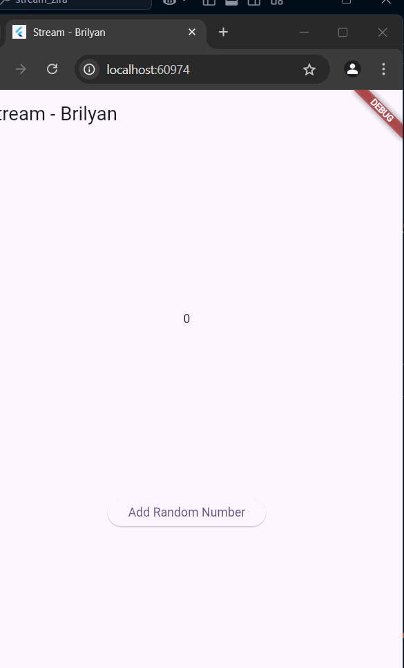
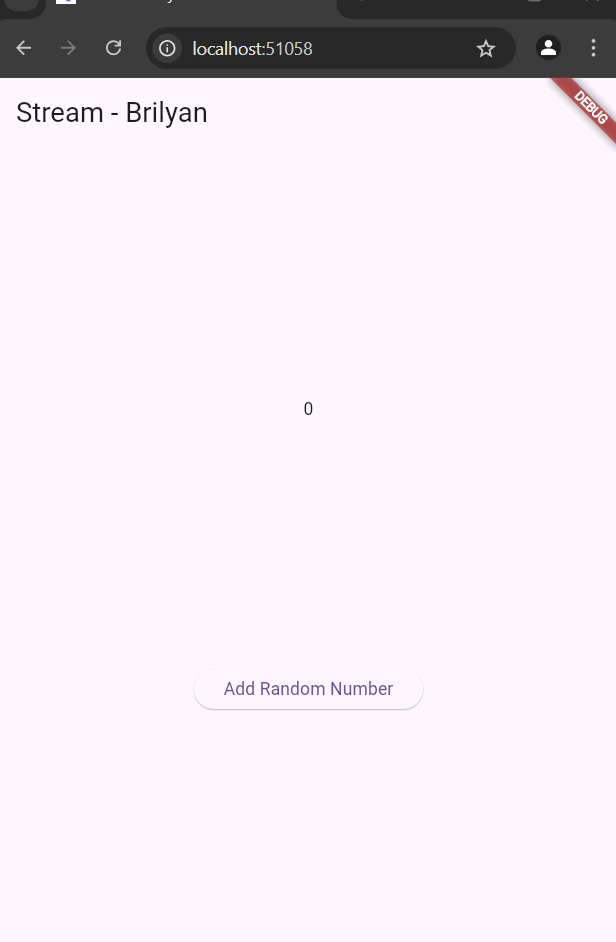
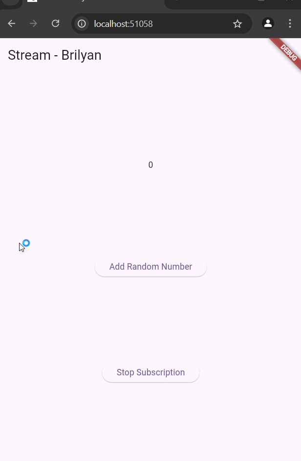

# Minggu 12
## Brilyan Satria Wahyuda
### TI-3H 2241720019

### Soal 3

Keyword yield* digunakan dalam Dart untuk mendeklarasikan bahwa sebuah generator (fungsi async* atau sync*) akan menghasilkan semua nilai dari stream atau iterable lain. Dalam konteks kode yield* digunakan untuk menghasilkan nilai dari stream yang dihasilkan oleh Stream.periodic.

### Soal 4

### Soal 5

Listen adalah metode untuk mendengarkan stream dan menerima data saat tersedia, Listen tidak memerlukan async

await for digunakan dalam fungsi async untuk menunggu dan iterasi nilai yang dihasilkan stream, await for perlu async

### Soal 6

Pada Langkah 8 akan dilakukan update initstate, terdapat inisialisasi numberstream, controller dan strea, setelah itu terdapat stream.listen, jika ada data baru yang di listen, setstate akan berjalan dengan mengubah lastnumber 
Pada langkah 10 akan dibuat function untuk menambahkan bilangan acak, menggunakan random.nextInt akan digenerate angka random dan disimpan di variable myNum, setelah itu angka yang ada di myNum akan ditambahkan ke sink stream numberStream

### Soal 7

Langkah 13 akan menambahkan metode addError untuk menghandle error 
Langkah 14 akan update initstate yang menambahkan apa yang akan dilakukan saat error terjadi 
Langkah 15 akan mengubah fungsi addRandomNumber dengan menambahkan .adderror() untuk memunculkan error

### Soal 8

StreamTransformer disini digunakan untuk mengubah data yang mengalir melalui stream sebelum data diterima listener. disini StreamTransformer<int,int> untuk memodifikasi nnilai integer yang mengalir melalui stream numberStreamController  
handleData dipanggil saat ada data baru yang mengalir di stream, disini nilai value dikalikan 10 sebelum diteruskan ke sink.
  handleError berfungsi saat terjadi error nilai -1 baru diteruskan ke sink sebagai penanda error   handleDone dipanggil ketika stream selesai, disini sink akan ditutup.   Stream dari numberStreamController diubah menggunakan transformer.
Data yang dihasilkan oleh stream yang telah diubah kemudian didengarkan menggunakan listen.
Setiap kali ada data baru (event), nilai lastNumber diperbarui dengan nilai yang telah dimodifikasi (dikalikan dengan 10).
Jika terjadi kesalahan, nilai lastNumber diperbarui dengan -1.

### Soal 9

Langkah 2 akan menambahkan subscription yang menangani perubahan pada event seperti praktikum sebelum  Langkah 6 menambahkan subscription.cancel pada metode dispose() untuk menghentikan subscription saat tidak digunakan. Pada langkah 8 ada modifikasi function addRandomNumber agar ada pengkondisian saat stream sedang dibuka atau tidak

